## 上下文注入全景

所有可能进入 LLM 上下文的内容、来源文件、注入位置、注入条件与优先级：

| 文件 | 内容 | 注入位置 | 注入条件 | 优先级 / 备注 |
|---|---|---|---|---|
| `templates/SOUL.md` | 人格与语气 | system prompt 静态段 | 始终注入 | 最高，第一段 |
| `templates/TOOL.md` | 工具使用偏好 | system prompt 静态段 | 始终注入 | — |
| `templates/USER.local.md` | 用户偏好档案 | system prompt 静态段 | 文件存在时注入 | 优先于 `init/USER.md`；不存在则降级 |
| `templates/init/USER.md` | 用户偏好模板（空白） | system prompt 静态段 | `USER.local.md` 不存在时降级注入 | 兜底 |
| `templates/agent/identity.md` | 工作区路径 + 文件结构说明 | system prompt 静态段 | 始终注入（Jinja2 渲染） | — |
| `memory/MEMORY.local.md` | 长期记忆（跨会话知识） | system prompt 静态段 | 文件存在且内容非空 | — |
| `skills/*/SKILL.md`（常驻） | 技能完整内容 | system prompt 静态段 | frontmatter 中 `always: true` | 全文注入 |
| `skills/*/SKILL.md`（按需） | 技能名称 + 描述摘要 | system prompt 静态段 | 有非 `always` 技能存在 | 仅摘要，不注入全文；用 `load_skill` 工具按需加载全文 |
| `control_manager.system_prompt()` | 当前权限模式指令 | system prompt 动态追加 | `control_manager` 存在（主 Agent 始终有） | 每轮 `_ask_model` 时追加在静态段末尾 |
| `clarification.prompt()` | Ask Guard 强制提问指令 | system prompt 动态追加 | `clarification.required == True`（用户消息命中 scope / risk / ui 关键词） | 仅触发时追加；同一 turn 只评估一次 |
| `memory/_checkpoint.json` | 上次未完成 turn 的完整 history | messages 数组（对话历史） | 启动时文件存在（进程崩溃恢复） | **优先于热日志**；正常 turn 结束后删除 |
| `memory/history.jsonl`（热日志活跃段） | 最近未归档的对话行 | messages 数组（对话历史） | 启动时无 checkpoint | checkpoint 存在时跳过此文件 |
| 当前 turn 实时消息 | user / assistant / tool 消息 | messages 数组（对话历史） | 本轮产生时实时追加 | — |
| `memory/YYYY-MM-DD.md` | 今日情景记忆 | **仅压缩时**传给 Compactor | token 超阈值触发压缩 | 不进主 Agent context；让压缩模型知道今天已记录什么 |
| `memory/MEMORY.local.md` | 当前长期记忆完整内容 | **仅压缩时**传给 Compactor | token 超阈值触发压缩 | 让压缩模型保留已有条目，不误删 |
| `templates/USER.local.md` | 当前用户档案完整内容 | **仅压缩时**传给 Compactor | token 超阈值触发压缩 | 让压缩模型保留已有偏好，有偏好信号才改 |
| `memory/history_archive/*.jsonl.gz` | 已归档原始对话行 | **永不注入** | — | 只归档留存；人工查阅 / 未来 RAG 扩展用 |

---

#### control_manager
| 模式 | 行为 |
|------|------|
| ask_before_edit | 默认。读操作直接跑，写/危险操作先进 AskCard 审批 |
| auto | 最高权限，工具层不主动审批 |
| plan | 只读探索 + ask_user + propose_plan，写操作全部禁用 |

**不同模式下的提示词**
`manager.py`
```python
    def system_prompt(self) -> str:
        if self.mode == ControlMode.PLAN.value:
            return (
                "# Control Mode: Plan\n\n"
                "- 当前处于 Plan 模式。你必须先通过只读探索理解环境，不允许修改文件、运行命令执行变更、派遣子代理或创建队友。\n"
                "- 若需求存在会影响方案的偏好或取舍，调用 `ask_user` 提问。\n"
                "- 当方案足够明确时，必须调用 `propose_plan` 提交完整计划，等待用户评论或批准。\n"
                "- 用户批准前不要执行计划。\n"
                "- 不允许用普通最终回复替代计划卡；最终必须通过 `propose_plan` 进入 PlanCard。"
            )
        return (
            "# Control Tools\n\n"
            f"- 当前权限模式：{self.mode}。\n"
            "- `ask_before_edit` 模式下，危险、不确定或高影响操作会触发权限审批；低风险读操作和普通编辑可继续执行。\n"
            "- `auto` 模式下，工具层不主动审批，但仍受路径安全、schema 校验和工具自身安全策略约束。\n"
            "- 当用户目标存在高影响歧义且无法通过读文件/搜索等方式确定时，调用 `ask_user` 提出结构化问题。\n"
            "- 高影响歧义包括范围/验收不清的大改动、架构/重构/UI 取舍、提交推送、删除覆盖、发布部署、成本/权限/安全边界。\n"
            "- 可通过只读探索确认的事实先探索；但在写入、高影响操作或最终答复前仍有关键取舍时，必须提问。\n"
            "- 只有在用户显式开启 Plan 模式后，才使用 `propose_plan` 提交等待批准的计划。"
        )
```

#### 工具前置处理
这三步是**发给 LLM 前的 history 治理管道**，依次执行：

##### 1. [_pair_tool_calls](cci:1://file:///Users/pencil/Desktop/emperor-agent/agent/runner.py:359:4-397:22) — 修复配对

确保每个 `assistant` 的 `tool_calls` 后面都有对应的 `tool` 消息，避免 OpenAI API 报"tool messages 不足"错误。

- 孤立的 `tool` 消息（没有对应 `tool_call`）→ 丢掉
- 有 `tool_call` 但缺少回复 → 补一条占位 `"（工具执行被中断）"`

##### 2. [_cap_tool_result](cci:1://file:///Users/pencil/Desktop/emperor-agent/agent/runner.py:412:4-432:18) — 单条硬截断

每条工具结果超过 **8000 字符**就截断，保留头 7800 + 尾 200。

- 防止单条超大输出（如读了一个巨型文件）直接撑爆 context
- 截断只在发给 LLM 的副本上，原 `history` 不动

##### 3. [_shrink_old_tool_results](cci:1://file:///Users/pencil/Desktop/emperor-agent/agent/runner.py:434:4-453:18) — 旧条目摘要化

最近 10 条工具消息保留原文，**更早的**大于 1500 字节的工具结果整条替换为一行摘要：

```
[已摘要] read_file → 原文 12000 字符已省略
```

- 防止历史工具结果累积占满 context
- 最近的保留原文（LLM 当前轮可能还需要参考）

---

**执行顺序有意义**：先修复结构 → 再截单条 → 再压缩旧历史，三步做完才把 `governed` 发给模型。


#### ClarificationPolicy


[ClarificationAssessment](cci:2://file:///Users/pencil/Desktop/emperor-agent/agent/control/clarification.py:31:0-48:31) 是 **Ask Guard 的评估结果对象**，决定当前 turn 是否必须强制先问用户。

## 数据结构

```@/Users/pencil/Desktop/emperor-agent/agent/control/clarification.py:32-38
@dataclass
class ClarificationAssessment:
    """澄清评估结果：是否需要在当前 turn 强制提问。"""
    required: bool = False               # 是否必须先问
    reason: str = ""                     # 触发原因（如 scope / risk / ui）
    categories: list[str] = field(default_factory=list)        # 命中的类别
    questions: list[dict[str, Any]] = field(default_factory=list)  # 预建问题列表
```

## 完整工作流程

**第一步：评估**（每轮 turn 开始前）

```
用户输入 → ClarificationPolicy.assess(history)
```

用正则匹配最新一条用户消息，命中以下任一类别就置 `required=True`：

| 类别 | 触发关键词示例 |
|---|---|
| `scope` | 工程化、重构、架构、优化、通读项目 |
| `risk` | 提交、删除、发布、部署、生产 |
| `ui` | UI、界面、前端、视觉 |

**豁免条件**（命中了也不触发）：
- 用户说"不用问/直接做/按你判断"
- 消息含 `[CONTROL:ASK_ANSWERED]`（已是恢复阶段）
- 消息足够详细（500字+、多标题/条目、含测试/接口描述）

**第二步：注入 system prompt**

```@/Users/pencil/Desktop/emperor-agent/agent/runner.py:343-345
            if clarification and clarification.required:
                system_prompt = f"{system_prompt}\n\n---\n\n{clarification.prompt()}"
```

`required=True` 时在 system prompt 末尾追加 Ask Guard 指令，告诉模型"写入前必须先调 `ask_user`"。

**第三步：工具层拦截**

```@/Users/pencil/Desktop/emperor-agent/agent/runner.py:552-553
        if clarification and clarification.required and self._ask_guard_blocks_tool(call.name):
            return _ASK_GUARD_BLOCK
```

如果模型不听话直接调写工具，工具层直接返回错误拦截，强制走 `ask_user` 流程。

## 一句话

[ClarificationAssessment](cci:2://file:///Users/pencil/Desktop/emperor-agent/agent/control/clarification.py:31:0-48:31) = **纯正则判断的哨兵**，零 LLM 开销，在模型执行前预判"这个请求有没有高影响歧义"，有的话强制先问。

---

#### 截断续写（Length Recovery）

模型每次调用有 `max_tokens` 上限（默认 20000）。输出到一半被强制截停时，`finish_reason` 会返回 `length` / `max_tokens`，此时回复不完整。

**截断续写**就是检测到这种情况后，自动追加一条 user 消息催模型继续写，而不是直接返回残缺内容。

##### 判断依据

```python
# agent/providers/base.py
TRUNCATED_FINISH_REASONS = frozenset({"length", "max_tokens", "model_max_tokens"})

def is_truncated(finish_reason: str | None) -> bool:
    return (finish_reason or "").lower() in TRUNCATED_FINISH_REASONS
```

| finish_reason | 含义 |
|---|---|
| `stop` | 模型正常结束 → 不触发 |
| `tool_calls` | 模型要调工具 → 不触发 |
| `length` / `max_tokens` | 输出被 token 上限截断 → **触发续写** |

##### 续写流程

```
检测到截断
 └─ final_parts.append(当前残缺片段)    ← 先缓存这段
 └─ history.append(role=assistant)      ← 写入残缺内容
 └─ history.append(role=user, "请从中断处续写，不要重复")
 └─ 继续主循环 → 再次调用 LLM
 └─ 下一段回复再 append 到 final_parts
 └─ 最终 "".join(final_parts) 拼成完整回复
```

最多重试 `_MAX_LENGTH_RECOVERIES = 3` 次，超过后直接返回已有内容。

---

## 完整执行流程图（用户输入 → 模型输出）

```mermaid
flowchart TD
    A([用户输入]) --> B["history.append role=user\n同时写入磁盘 history.jsonl 持久化"]
    B --> C["step_async(history)\nAgentRunner 主入口：接收 history 引用并就地修改\n在 while True 循环中反复 调用LLM→执行工具→判断收敛\n直到模型给出最终文本回复才 return"]

    C --> D["_assess_clarification(history)\n用正则扫描最新用户消息\n命中 scope/risk/ui 关键词 → required=True\n豁免：用户说直接做 / 消息>500字 / 恢复阶段\n结果影响：① system prompt 追加 Ask Guard 指令\n② 工具层拦截写操作"]
    D --> E["write_checkpoint\n将 history 序列化写到 memory/_checkpoint.json\n进程被杀时下次启动从此恢复，不重跑整个 turn"]

    E --> LOOP{主循环\n每轮: LLM调用→分支处理\n达到 max_turns 上限则强制中止}

    LOOP --> F["_ask_model(history)\n不修改原 history，在副本上执行治理管道后调 LLM"]

    subgraph GOVERN ["history 治理管道（在副本上操作，发给 LLM 前）"]
        G1["_pair_tool_calls\n扫描 history 确保 assistant.tool_calls\n与后续 role=tool 消息一一配对\n孤立 tool 消息丢弃 / 缺回复补占位"] -->
        G2["_cap_tool_result\n单条 tool result > 8000字 → 截断\n保留头 7800 + 尾 200，防单条撑爆 context"] -->
        G3["_shrink_old_tool_results\n最近 10 条 tool 保留原文\n更早的 >1500字 替换为一行摘要\n防历史工具结果累积占满 context"]
    end

    F --> GOVERN
    GOVERN --> G4["拼接最终 messages 数组：\nsystem prompt（SOUL+TOOL+USER+MEMORY）\n+ control_manager 权限模式说明\n+ Ask Guard 指令（若 required=True）\n+ 治理后的 governed history"]
    G4 --> G5["ModelCaller.ask → LLM API\n封装 provider 选择、流式 delta 推送\n主模型失败时自动 fallback 到备用模型\n返回统一响应: content/tool_calls/finish_reason/usage"]
    G5 --> H[/"模型响应 response"/]

    H --> I["token_tracker.record\n写入 memory/tokens.jsonl 记录本次 input/output token\n用于后续压缩阈值判断\n\n推送 context_usage 事件到前端\n驱动 WebUI 上下文用量环实时更新"]
    I --> I2["写 model_call 元数据到 history.jsonl\n含：模型名/provider/token数/用户输入摘要\n/AI输出摘要/斜杠命令标记，便于回溯调试"]

    I2 --> J{"response.should_execute_tools?\ntool_calls 不为空 → True（走工具）\n纯文本或空 → False（走收敛）"}

    J -- 是 --> K["_execute_tool_calls(tool_calls)\n批量执行本轮所有工具调用\n按并发策略分组执行"]

    subgraph TOOLS ["工具执行（每个工具依次经过三道门禁）"]
        T1["① Plan 模式白名单检查\nplan 模式下只有只读工具\n+ ask_user + propose_plan 可通过"] -->
        T2["② Ask Guard 拦截检查\nclarification.required 且工具非只读\n→ 直接返回错误，强制走 ask_user"] -->
        T3["③ PermissionManager 权限评估\nask_before_edit 模式下评估风险等级\n高风险触发审批卡"] -->
        T4["asyncio.to_thread 执行工具\n在线程池中同步运行工具函数\n需要 runtime context 的额外注入 loop/emit"]
    end

    K --> TOOLS

    TOOLS -- "连续 concurrency_safe=True 的工具" --> T5["asyncio.gather 并发执行\n如多个 read_file / glob 同时跑"]
    TOOLS -- "非并发 / exclusive 工具" --> T6["_run_serial 严格串行\n每步均检查暂停信号"]

    T5 --> T7{"工具结果含暂停信号?\nask_user/propose_plan 返回结构化 JSON 标记"}
    T6 --> T7

    T7 -- "是：检测到暂停标记" --> P1["组装 tool messages：\n已执行的→真实结果\n触发暂停的→'等待用户回复'占位\n未执行的→'跳过'占位\n\nhistory.extend → write_checkpoint\n推送 ask_request/plan_draft 事件\n推送 turn_paused 事件"]
    P1 --> P2(["抛出 TurnPaused 异常\n外层 loop/WebUI 捕获并挂起\n等待用户回答后恢复执行"])

    T7 -- 否 --> T8["history.extend tool_messages\n此时 history 处于 tool_calls 与 tool result\n严格配对的一致点\nwrite_checkpoint（进程被杀可从此续命）"]
    T8 --> LOOP

    J -- 否 --> K2{"reply 为空?\n模型无内容也无 tool_calls\n可能 API 抽风或上下文不明确"}
    K2 -- "是且 empty_retries < 2" --> K3["注入 role=user 催促消息：\n'上一轮无任何输出，请继续推进'\n继续循环"]
    K3 --> LOOP
    K2 -- 否 --> K4{"finish_reason = length?\n模型输出达到 max_tokens=20000 被截停\n且 length_retries < 3"}
    K4 -- 是 --> K5["final_parts.append 缓存残缺片段\nhistory.append 残缺内容\n注入续写 prompt：'请从中断处续写'\n继续循环，最终 join 拼成完整回复"]
    K5 --> LOOP

    K4 -- 否 --> K6{"clarification.required\n且模型有实质回复?\n即模型没调 ask_user 就直接回答了"}
    K6 -- 是 --> P3["_pause_for_clarification\n创建 ask interaction\n写 checkpoint → 推送事件 → TurnPaused\n强制先问用户再继续"]
    P3 --> P2

    K6 -- 否 --> K7{"Plan 模式且 should_enforce_plan_final?\n模型最终回复不能直接返回用户"}
    K7 -- 是 --> P4["_pause_for_plan\n将回复解析为结构化 PlanCard\n写 checkpoint → 推送事件 → TurnPaused\n等用户 approve/comment/cancel"]
    P4 --> P2

    K7 -- 否 --> K8["正式落地：\nhistory.append role=assistant\nmemory_store.append_history 写入磁盘日志"]

    K8 --> K9{"TodoStore 有未完成任务?\nstatus ≠ completed 的条目存在"}
    K9 -- 是 --> K10["注入 todo nudge：\n列出剩余 todo 提示模型继续执行\n直到全部 completed"]
    K10 --> LOOP
    K9 -- 否 --> K11["_maybe_compact：\ntoken 用量 > max_context × 0.7 时触发\nCompactor 取 history[:-10] 调次模型生成摘要\n写入 MEMORY.local.md / YYYY-MM-DD.md\n原始归档到 history_archive/*.jsonl.gz\nhistory 就地替换为压缩后短版本"]
    K11 --> K12["clear_checkpoint\n删除 _checkpoint.json\n标志本 turn 正常完成"]
    K12 --> Z(["返回 final_reply\nCLI 打印 / WebUI 推送 assistant_done 事件"])
```

